# Azure Cloud Deployment of Multi-Honeypot Platform (T-Pot) 

A cloud-based multi-honeypot deployment using **T-Pot**, hosted on **Microsoft Azure**, to detect, log, and analyze cyber threats in real time. This project demonstrates how to deploy, configure, and manage an integrated honeypot system on Azure to enhance security visibility and incident response capabilities.

---

## Table of Contents

* [Project Overview](#project-overview)
* [Features](#features)
* [Architecture](#architecture)
* [Technologies & Tools](#technologies--tools)
* [Screenshots](#screenshots)
* [Getting Started](#getting-started)

  * [Prerequisites](#prerequisites)
  * [Deployment Steps](#deployment-steps)
* [Monitoring & Threat Analysis](#monitoring--threat-analysis)
* [Security Considerations](#security-considerations)
* [Testing & Validation](#testing--validation)

---

## Project Overview

This project implements a **Multi-Honeypot Platform** using **T-Pot**, a collection of honeypots integrated into a single system, deployed on **Microsoft Azure Cloud**. The setup collects and visualizes attack data to study cyber threat patterns and strengthen defense mechanisms.

**Objective:**

* Deploy a full-fledged honeypot system in a cloud environment.
* Capture and analyze real-world attack data.
* Visualize intrusion attempts using dashboards and logs.

---

## Features

* **T-Pot Deployment on Azure Cloud** — utilizes a virtual machine (VM) to host the honeypot system.
* **Multiple Honeypots** — includes Cowrie, Dionaea, ElasticPot, and others integrated through T-Pot.
* **Threat Visualization** — real-time dashboards via Attack Map, Kibana, and ElasticVue.
* **Network Configuration** — custom security rules and inbound port allowances to simulate vulnerable environments safely.
* **Centralized Data Logging** — all honeypot logs stored and visualized for analysis.

---

## Architecture

```
[Internet] → Azure Firewall / NSG → Azure VM (T-Pot)
                                 ↓
                          [Elastic Stack: Kibana, ElasticVue]
                                 ↓
                         [Dashboards & Threat Analytics]
```

* **Azure Virtual Machine** hosts the T-Pot platform.
* **Network Security Group (NSG)** configured to allow controlled inbound traffic.
* **Elastic Stack** enables data visualization, filtering, and attack analysis.

---

## Technologies & Tools

* **T-Pot** (Community Edition) — multi-honeypot framework
* **Microsoft Azure** — cloud hosting and resource management
* **Elastic Stack (ELK)** — data collection and visualization
* **Linux (Ubuntu 22.04 LTS)** — base OS for VM deployment
* **Putty / SSH** — remote access and management
* **Attack Map & ElasticVue** — real-time visualization tools

---

## Screenshots

Screenshots from the deployment and dashboards are provided in the `assets/screenshots/` directory and project documentation. 

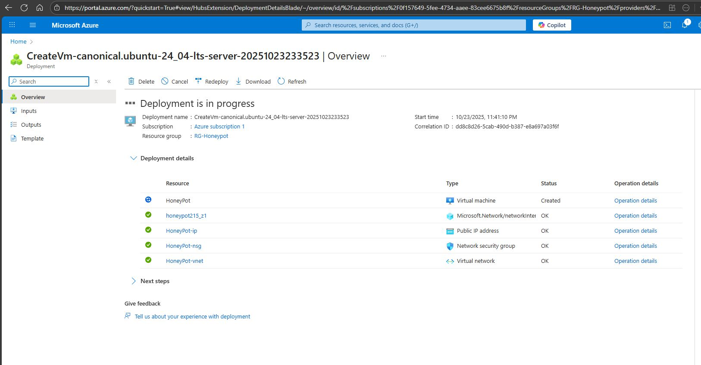
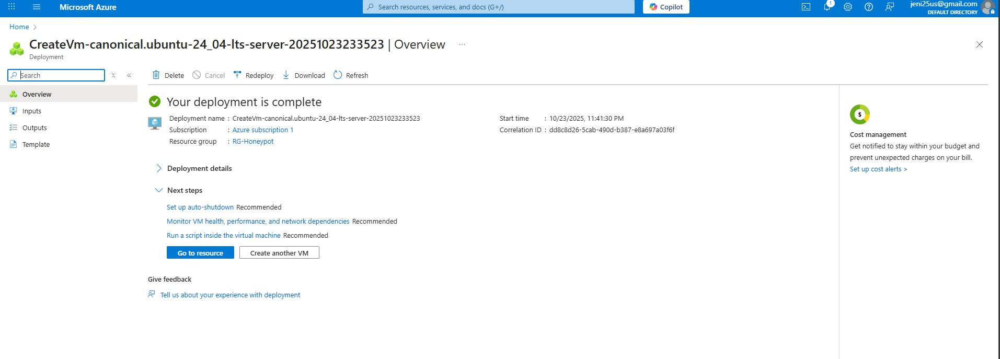
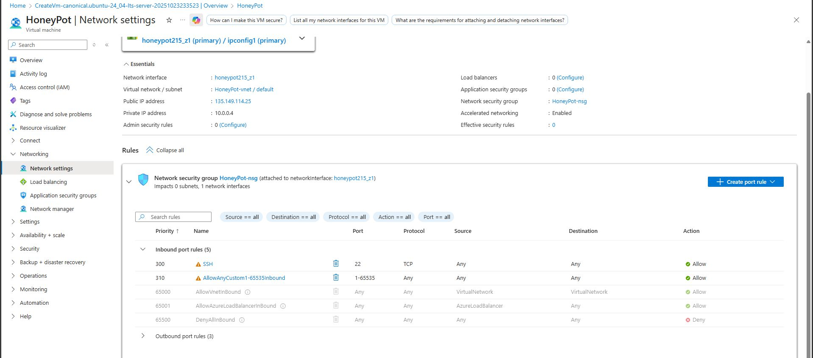
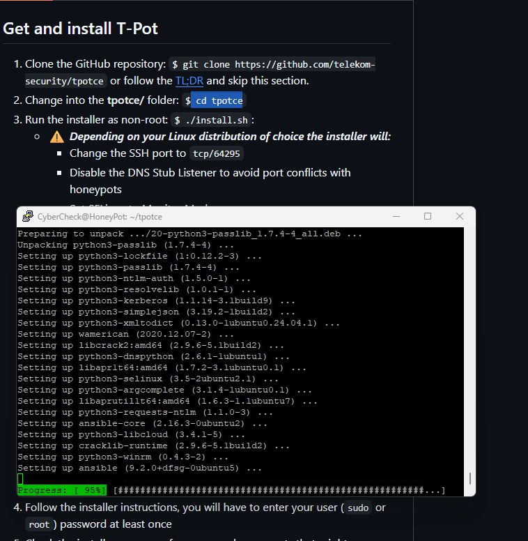
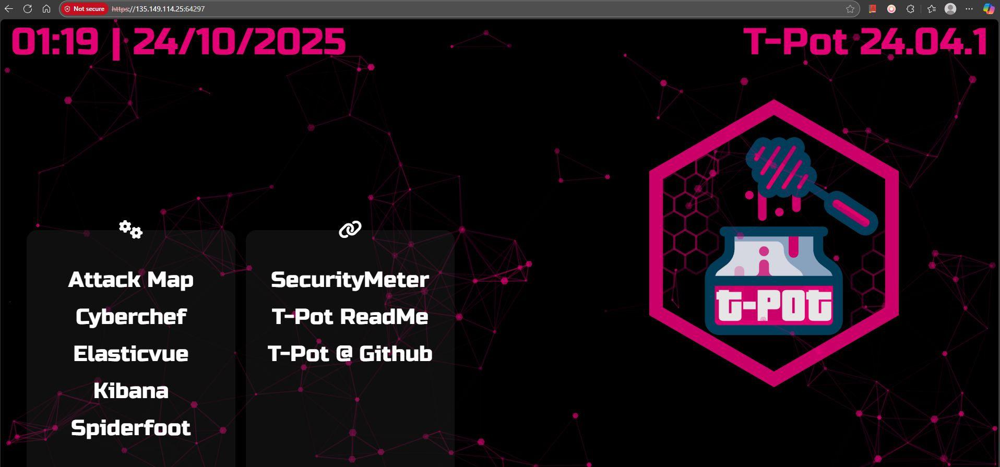
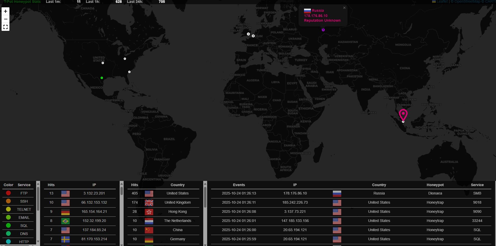
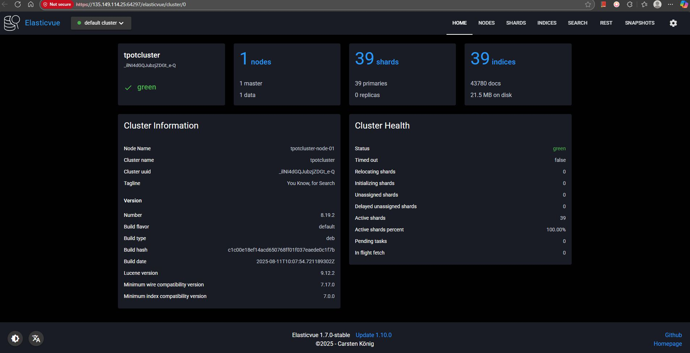
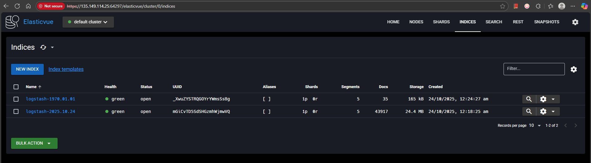
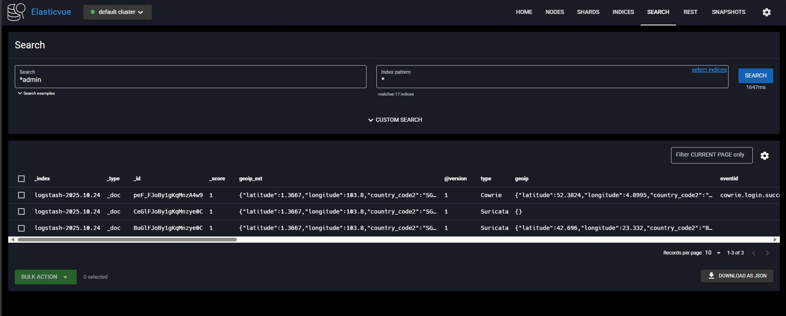
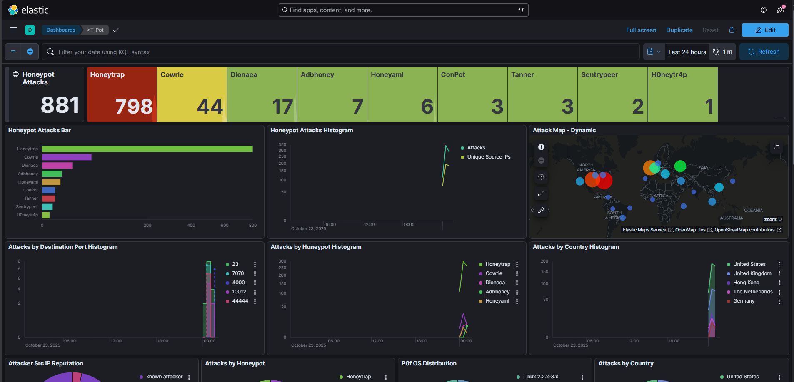
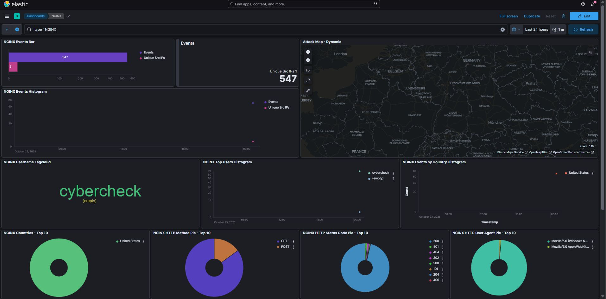
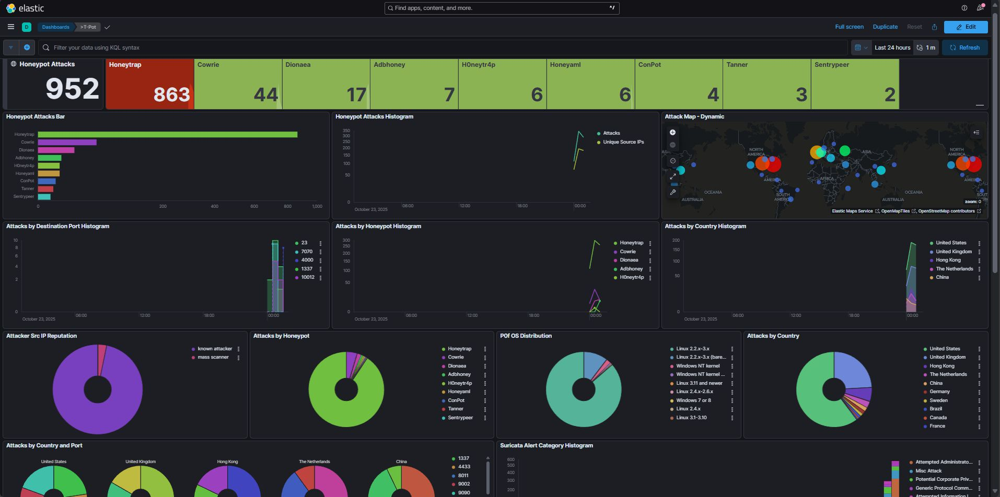
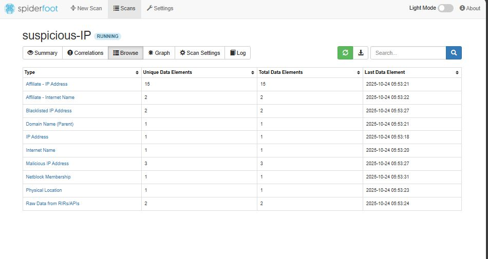

---

## Getting Started

### Prerequisites

* Microsoft Azure account with access to create virtual machines
* Basic knowledge of Linux commands and SSH
* Putty or any SSH client
* Minimum recommended VM: 4 GB RAM, 2 vCPUs, 60 GB storage

### Deployment Steps

1. **Create Azure Virtual Machine**

   * OS: Ubuntu 22.04 LTS
   * Size: Standard B2s or higher
   * Configure inbound ports (22, 80, 443, and optionally 8080-64297 for honeypots)

2. **Access the VM using SSH (Putty)**

   ```bash
   ssh azureuser@<vm-public-ip>
   ```

3. **Install T-Pot**

   * Update system: `sudo apt update && sudo apt upgrade -y`
   * Run T-Pot installer:

     ```bash
     wget https://github.com/telekom-security/tpotce/archive/refs/heads/master.zip
     unzip master.zip
     cd tpotce-master
     sudo ./install.sh
     ```
   * Follow interactive prompts for installation and configuration.

4. **Reboot and Access Dashboards**

   * Default dashboards: `https://<vm-ip>:64297`
   * Tools include Kibana, Attack Map, ElasticVue, and more.

5. **Monitor and Collect Data**

   * View incoming attack patterns in real time via Attack Map.
   * Analyze event logs and honeypot data in Kibana.

---

## Monitoring & Threat Analysis

T-Pot integrates multiple honeypot services and the Elastic Stack for monitoring:

* **Attack Map**: Real-time visualization of active attacks.
* **Kibana Dashboards**: Explore, filter, and analyze honeypot logs.
* **ElasticVue**: Database viewer for detailed inspection of stored events.
* **Log Files**: Stored locally in `/data/` directory for forensic analysis.

---

## Security Considerations

* Use a dedicated resource group and restrict Azure access with role-based controls.
* Limit inbound ports to essential honeypot services only.
* Regularly rotate VM credentials and SSH keys.
* Monitor Azure Network Security Groups (NSGs) and logs for unusual activity.
* Store and analyze honeypot data in a secure, isolated environment.

---

## Testing & Validation

* Verified honeypot accessibility over the internet.
* Monitored live attack attempts and recorded data via Attack Map.
* Cross-checked captured logs in ElasticVue and Kibana.
* Ensured that data visualization and alerts were properly generated.

---

